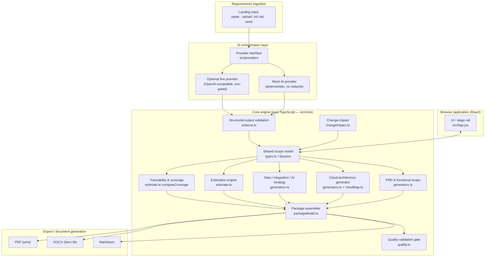

# Architecture

Scopewright is a **browser application with a pure, framework-agnostic core engine**. There is no backend: the app runs entirely in the browser, and the AI layer is pluggable (mock by default, optional live provider). The scope model is the single source of truth that every deliverable is derived from.

## Component diagram

## Why this shape

- **Single source of truth.** The `Session` scope model holds reviewed requirements, assumptions and questions. Every generator is a *pure function of the model*, so editing a requirement re-derives the PRD, architecture, coverage and estimate automatically. This is what makes it a connected model rather than a set of independent prompts.
- **Traceability by construction.** Requirements carry `sourceText` + `classification`. Capabilities, architecture components, AI use cases and estimate rows all store the requirement IDs they consume, so coverage and dangling-reference checks are computable, not manual.
- **Reproducible estimation.** `computeEstimate` derives every number from visible scope factors and configurable commercial inputs. No number originates from free-text model output.
- **Safe AI boundary.** The mock provider needs no network and runs the full experience; the optional live provider’s structured output is schema-validated and falls back to mock on any failure — so paid access is never required.

## Data flow (happy path)

1. User provides requirements → **provider.analyze** returns a candidate analysis.
2. Analysis is **schema-validated** and admitted into the **scope model**.
3. User reviews/edits/approves the model.
4. Generators derive PRD, architecture (per selected cloud), data/integration/AI strategy.
5. Estimation engine computes reproducible effort/timeline/ROM.
6. Coverage + quality gate validate consistency.
7. Change-impact lets the user perturb one input and see affected vs. preserved outputs.
8. Package assembler serializes to Markdown / DOCX / PDF with the mandatory disclaimer.
